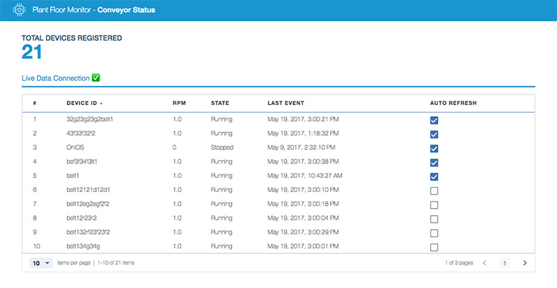

# MonitoringControl


This project was generated with [Angular CLI](https://github.com/angular/angular-cli) version 1.0.0-rc.1.

## To Run Locally

1. Run `npm install -g @angular/cli` to install the Angular CLI
2. Run `npm install`
3. Create a file named 'basicConfig.json' in the root folder of this repo with this content:
```json{
  "org":      "{{your_org_ID}}",
  "apiKey":   "{{your_API_key}}",
  "apiToken": "{{your_API_token}}*"
}```
3. Run `npm run build-run` to build the project and start the app.
4. Go to [http://localhost:3000](http://localhost:3000) on your browser

## To Deploy to Bluemix

1. Run `npm install -g @angular/cli` to install the Angular CLI
2. Run `npm run push` to build the project and push using **Cloud Foundry**.
